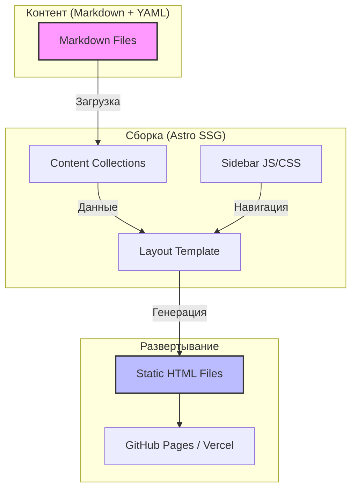

Когда я решил завести свой личный блог, у меня было одно четкое требование: он должен быть быстрым, аскетичным и при этом ощущаться как родная IDE. Никакого визуального мусора, только код, текст и удобная навигация.

В этой статье я расскажу, как я собрал то, что вы видите перед собой, и какие «грабли» пришлось обойти, чтобы подружить современный веб с ламповым текстовым интерфейсом.

## Стек технологий

Я остановился на **Astro**. Это сейчас золотой стандарт для контентных сайтов. 

- **Astro**: Генерация статики (SSG). Весь блог — это набор HTML-файлов, которые отдаются мгновенно.
- **Pico.css**: Потрясающе легкий фреймворк. Он берет стандартные HTML-теги и делает их красивыми без сотен классов.
- **JetBrains Mono**: Тот самый шрифт, который делает любой интерфейс чуточку «техничнее».
- **Chroma**: Для подсветки синтаксиса в блоках кода (через интеграцию Astro).

## Архитектура: Файлы — это всё

В основе блога лежит принцип **Content-first**. Все статьи — это просто Markdown-файлы в папке `src/content/blog/`.



Astro автоматически типизирует эти файлы через `Content Collections`. Это позволяет мне на этапе сборки проверять, что у каждой статьи есть дата, заголовок и раздел.

## Фишки сайдбара

Самая сложная и интересная часть — навигация. Я хотел, чтобы она работала как дерево файлов в VS Code.

### Поиск с транслитерацией

Поскольку блог на русском, а файлы часто называются латиницей, я реализовал «умный» поиск. Если вы пишете «архитектура», скрипт на лету превращает это в `arhitektura` и находит нужный файл.

```js
const ruToEn = { 'а':'a', 'б':'b', 'в':'v', ... };
function transliterate(text) {
  return text.split('').map(c => ruToEn[c] ?? c).join('');
}
```

### Умная сортировка

Блог умеет сортировать дерево файлов по дате (новые/старые сверху). Причем это **глобальная сортировка**: если в папке `life/` есть более свежая статья, чем в `dev/`, вся папка `life/` прыгнет выше.

### Сохранение состояния

Поскольку это статический сайт, при каждом клике страница перезагружается. Чтобы поиск не сбрасывался, а дерево не «прыгало», я использую `localStorage`. Вы перемещаетесь по статьям, а настройки навигации остаются с вами.

## Чистота контента

Чтобы работа с текстом была максимально приятной, я настроил автоматизацию:

1. **Layout** автоматически подхватывает `title` из метаданных (frontmatter) и делает его главным заголовком страницы.
2. **Markdown** остается чистым. В нем нет лишних `h1`, только суть и подзаголовки.
3. **Markdownlint** настроен так, чтобы не ругаться на отсутствие заголовка в первой строке, так как система добавит его сама.

## Почему это стоит повторить?

Такой подход дает невероятное чувство контроля. Вы не зависите от баз данных, вам не нужен сложный сервер. Ваш блог — это репозиторий на GitHub. Вы пишете текст в любимом редакторе, делаете `git push`, и через минуту новая статья уже в сети. А еще вам не надо думать о бэкапах, так как git -- лучший файлообменик (а не skype).
